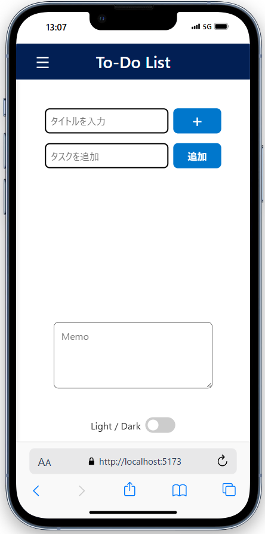

# Todoアプリ（React + TypeScript）

これは、ReactとTypeScript を用いて作成したシンプルなToDoアプリです。  
ローカルストレージに保存されます。

---

##  公開URL（Vercel）

https://simple-todo-navy-nine.vercel.app

---

##  制作の目的・コンセプト

「誰でもすぐ使える」「迷わず操作できる」ことを重視して設計しました。  
機能はシンプルに絞り、タイトル・タスク・メモの3項目のみを採用。カテゴリ機能などをあえて除外し、見やすさ・使いやすさを優先しました。  
Light/Darkテーマ切り替えやスマホ対応も意識し、ユーザー体験を意識したデザインに挑戦しています。

##  制作のポイント

- 最小限の要素で完結する、シンプルなUI設計
- ローカルストレージによるデータ保持・復元
- Light/Dark テーマの切り替え対応
- スマートフォン表示へのレスポンシブ対応

##  担当作業

- アプリの企画・構成・画面設計
- React + TypeScript による実装
- タスク管理・保存機能の構築
- UIアイコンに `lucide-react` を使用

##  制作を通して学んだこと

このToDoアプリの制作を通じて、ReactやTypeScriptの基本構造に触れることができました。  
一方で、JavaScriptの基礎理解の甘さや、データを扱う際のAPI・バックエンド（Node.js / Express / MySQL）連携への理解不足も痛感し、今後の学習課題として取り組んでいきたいと感じています。

---

##  使い方（ページ構成）

1. **タイトル入力フォーム**  
　To-Doリストのプロジェクト名などを入力し、「＋」ボタンでローカルストレージに保存されます。

2. **タスク入力フォーム**  
　タイトル内の個別タスクを入力し、「追加」ボタンで登録されます。

3. **メモ欄**  
　自由記述が可能なテキストエリアで、タスクに関する補足情報やメモを入力できます。

4. **テーマ切り替え**  
　画面下部の「Light / Dark」トグルスイッチで、全体のテーマを変更できます。

5. **サイドバー機能**  
　保存されたタイトル一覧が表示され、クリックでそれぞれのタスク内容が切り替えられます。

---

##  機能一覧

- タスクの追加・削除
- ローカルストレージへの保存
- ダークモード切り替え機能（対応済み）

---

##  使用技術・ツール

- React（Hooks）
- TypeScript
- CSS Modules
- Git / GitHub
- Vite
- ローカルストレージ

---

##  今後の拡張予定

- Node.js + Express + MySQL によるAPI連携
- 本格的なログイン・ユーザー管理機能
- クラウド保存（Firebase, Supabaseなど）対応

---

## スクリーンショット

---

##  作者

**Yanaga Masaru（masaru1123）**  
React／TypeScript 学習中。  
他のアプリも順次GitHubにて公開予定です。

